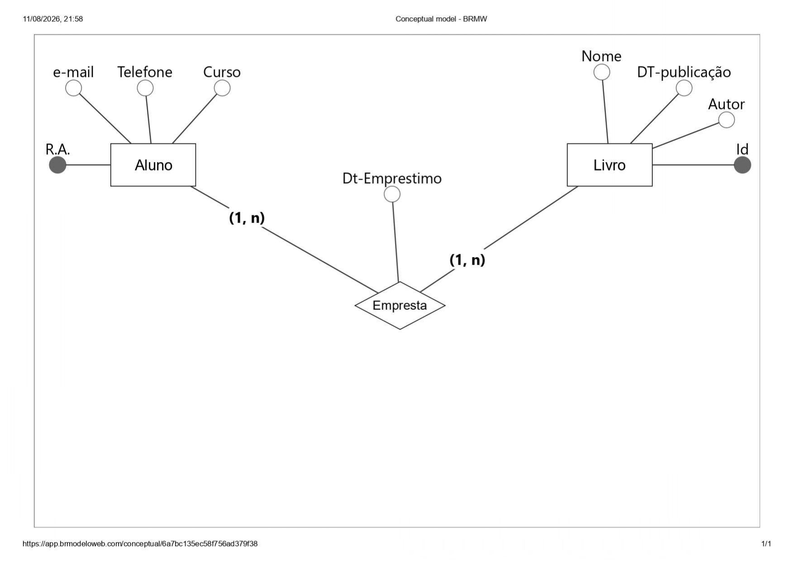

# MER e DER 11/08/2026

## Modelo Entidade Relacionamento

 **Modelo Entidade Relacionamento** (também chamado Modelo ER, ou simplesmente MER) é um modelo conceitual utilizado na Engenharia de Software para descrever os objetos **(entidades)** envolvidos em um domínio de negócios, com suas características **(atributos)** e como elas se relacionam entre si **(relacionamentos)**.

Em geral, este modelo representa de forma **abstrata** a estrutura que possuirá o banco de dados da aplicação. 

### Entidades e seus tipos

Entidade é uma representação de um objeto, pessoa, lugar, evento ou conceito do mundo real que sobre o qual queremos guardar informações. Ela pode ser classificada como entidades físicas e lógicas, de acordo com sua existência no mundo real.

. *Entidades físicas*: São aquelas realmente tangíveis, existentes e visíveis no mundo real, como um cliente ou um produto por exemplo.

. *Entidades Lógicas*: São aquelas que existem geralmente em decorrência da interação entre ou com entidades físicas, que fazem sentido dentro de um certo domínio de negócios, mas que no mundo externo/ral não são objetos físicos.

. *Entidades fortes*: São aquelas cuja existência não depende de outras entidades, ou seja, por si só elas já possuem total sentido de existir. Em um sistema de vendas, a entidade produto, por exemplo, não depende de quaisquer para existir.

. *Entidades fracas*: Ao contrário das entidades fortes, as fracas são aquelas que dependem de outras entidades para existirem, pois individualmente elas não fazem sentido.

. *Entidades associativas*: esse tipo de entidade  surge quando há necessidade de associar uma entidade a um relacionamneto existente. Na modelagem Entidade-Relacionamento não é possivel que um relacionamento seja associado a uma entidade, então tornamos esse relacionamneto uma entidade associativa, que a partir daí poderá se relacionar com outras entidades.

### Relacionamentos

Uma vez que as entidades são identifificadas, deve-se então definir come se dá o relacionamento entre elas. De acordo com a quatidade dos objetos envolvidos em cada lado do relacionamento, que podemos classificalos de três formas:

. *Relacionamento 1..1(uma para um)*: cada uma das entidades envolvidas referenciam obrigatoriamente apenas uma unidade da outra. Por exemplo, em um banco de dados de currículos, cada usuário cadastrado pode possuir apenas um currículo na base, ao mesmo tempo em que cada currículo só pertence a um único usuário cadastrado.

. *Relacionamento 1..n ou 1..* (um para muitos)*: uma das entidasd envolvidas pode se resferenciar várias unidades da outra, porém, do outro lado cada uma das várias unidades referenciadas só pode estar ligada uma unidade da outra entidade. Por exemplo, num sistema de planp de saúde, um usuário pode ter vários dependentes, mas cada um só pode estar ligado a um usuário.

. *Relacionamento n..n ou *..* (muitos para muitos)*: nesse relacionamento cada entidade, de ambos os lados, podem referenciar múltiplas unidades da outra. Por exemplo , em um sistema de biblioteca, um título pode ser escrito por vários autores, ao mesmo tempo em que um autor pode escrever vários títulos.

Em geral, os relacionamentossão nomeados com verbos ou expressões que representam a forma como as entidades interagem, ou a ação que uma exerce sobre a outra.

### Atributos 

Atributos são caracterìsticas que descrevem cada entidade dentro do domínio. Durante a ánalise de requisitos, são identificados os atributos relevantes de cada entidade naquele contexto, para manteer o modelo mais simples possível e armazenar apenas informações que serão úteis. 

Os atributos podem ser classificados quanto á sua função da seguinte forma:

. *Descritivos*: representam caractrística intrínsecas de uma entidade, tais como nome ou cor.

. *Nominativos*: além de serem também descritivos, estes tem a função de definir e identificar um objeto. Nome, código, número são exemplos de atributos nominativos.

### Estrutura dos atributos:

. *Simples*: Um único atributo define uma característica da entidade. Exemplo: nome, peso.

. *Compostos*: para definir uma informação da entidade, são usados vários atributos. Por exemplo, o endereço pode ser composto por rua, número, bairro, etc.

Alguns atributos representam valores únicos que identificam a entidade dentro do domínio e não podem se repetir. Em um cadastro de clientes, por exemplo, esse atributo poderia ser o CPF. A estes chamamos de Chave Primária.

Já os atributos referenciais são chamados de Chave Estrangeira e geralmente estão ligados à chave primária da outra entidade. Estes termos são bastante comuns no contexto de bancos de dados. Mantendo o exemplo anterior, a entidade cliente tem como chave primária seu CPF, assim, a venda possui também um campo “CPF do cliente” que se relaciona com o campo CPF da entidade cliente.

Enquanto o **MER** busca utilizar de conceitos para representar de forma abstrata, o **DER** tenata colocar os conceitos de uma forma visual.

## Diagrama-Der

 O diagrama de Entidade-Relacionamento, conhecido também como DER é um. É um tipo de diagrma estrutural usado em projetos como banco de dados. Nele contém diferentes símbolos e conectores que vizualizam duas informações dentre elas: entidades dentro do escopo do sistema e as relações dessas entidades. Por isso o devido nome "Entidade e "Ralecionamento".

## Erros Comuns na Modelagem MER/DER
1- Confundir Entidade com Atributo
Exemplo: Colocar "Endereço" como um atributo simples da entidade "Cliente", quando o endereço pode ser uma entidade com vários atributos(rua, número, cidade, cep).

2-Não Definir Claramente as Chaves Primárias
Exemplo: Não identificar atributos chave para garantir a unidade de registros.

3- Cardinalidade e Participação Mal Definidas
Exemplo: Não Especificar corretamente se a participação é total ou parcial e a cardinalidade.

## Boas Práticas
1- Entenda Bem o Problema e o Domínio
Converse com usuários, analise os processos e requisitos antes de começar a modelar.

2- Comece Simples
Faça um modelo inicial com as entidades principais, depois adicione detalhes e complexidade gradualmente.

3- Use Diagramas para vizualizar o Modelo
Desenhe o DER para facilitar a vizualização das entidades, atributos e relacionamentos. Atualize o diagrama conforme a modelagem evolui.

## Como Ultilizar IA para Modelagem MER e DER
A (IA) pode ser uma aliada poderosa na modelagem de dados, especialmente para MER e DER. Pode-se ultilizar a IA em diferentes etapas na modelagem, facilitando o processo, evitando erros e acelerando seu trabalho.

Exemplo: "Tenho um sistema de biblioteca com livros, autores, leitores e empréstimos. Cada livro tem título e ano. Um autor pode ter vários livros. Leitores podem pegar emprestado vários livros"

## Sugestão de Atributos e Relacionamentos
Com base em descrições do negócio, a IA pode sugerir quais atributos são importantes para cada entidade e que tipo de relacionamento faz sentido(1:1, 1:N, N:N), até sugerir regras de integridade e cardinalidade.

## Validação e Revisão de Modelos
Você pode fornecer um modelo(ou descrição dele) para a IA e pedir alguns feedbacks como: Identificar possíveis erros ou inconsistências , sugerir melhorias ou simplificações, checar se as regras de negócio estão bem representados dentre outros.

## Conversão de MER para modelo Relacional
A IA poderá ajudar na tradução do modelo conceitual MER para o modelo lógico relacional(tabelas, colunas, chaves), economizando o esforço manual e minimizados erros.

## Documentação Automática
A IA pode ajudar a criar documentos de forma clara e didática para os desenvolvedores, analistas e gestores que  entendem as estruturas do bando de dados. A inteligencia Artificial tem mostrado uma ferramente valiosa no processo de modelagem de dados, especialmente na criação e otimização de modelos do tipo MER e DER. Sendo possível acelerar a geração de diagramas a partir de descrição textuais, e relacionamentos, validar modelos evitando erros comuns até converter automaticamente modelos conceituais em esquemas relacionais prontos para implementação. Entretanto, esta integração representa uma importante evolução, tornando-se o desenvolvimento de bancos de dados mais ágil, preciso e alinhada ás necessidades reais de negócios. 

## Exemplo de DER de uma Biblioteca

Fonte: [devmedia](https://www.devmedia.com.br/mer-e-der-modelagem-de-bancos-de-dados/14332)